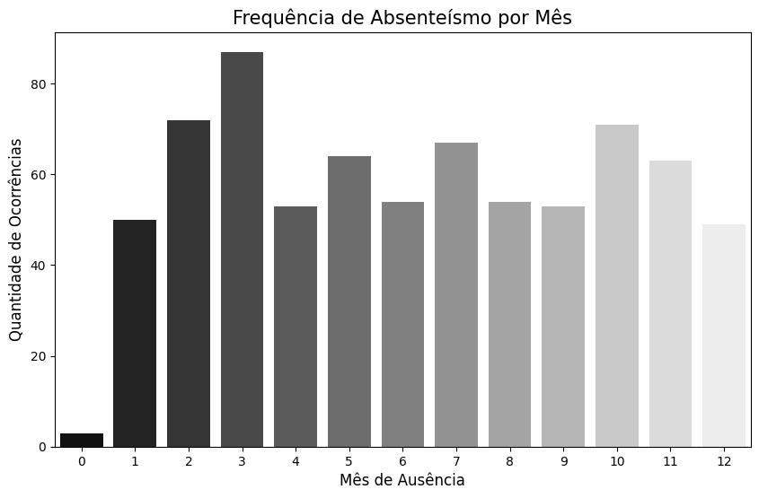
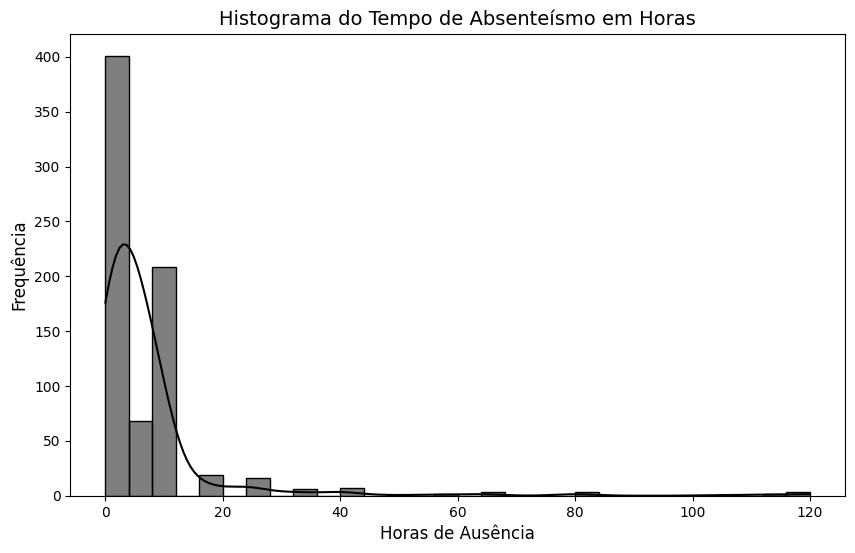
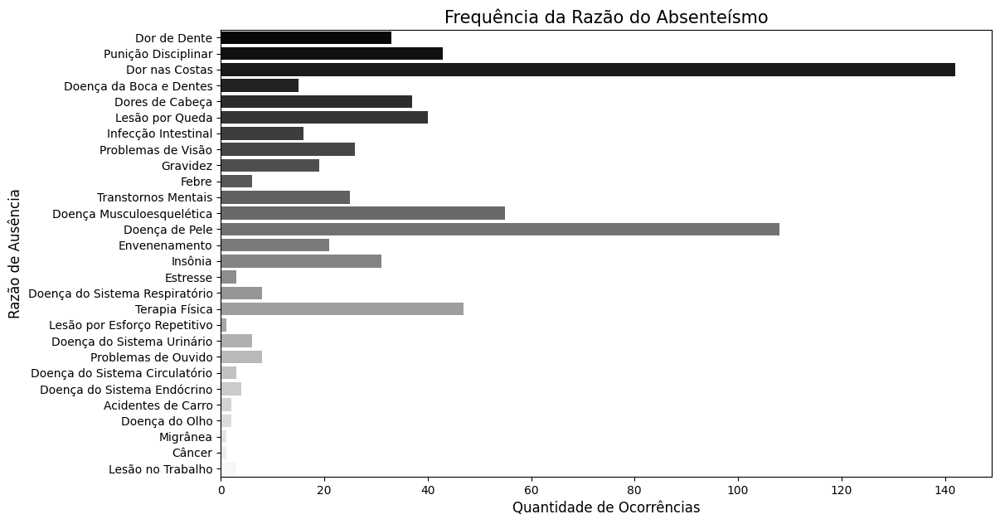
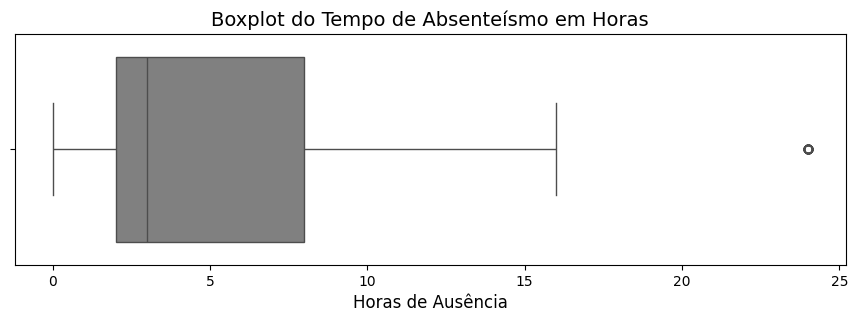
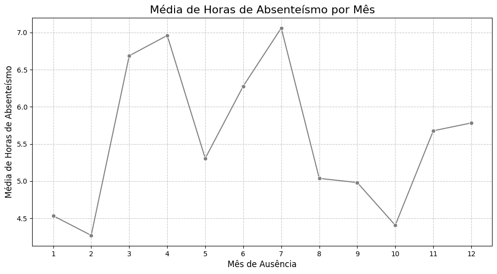
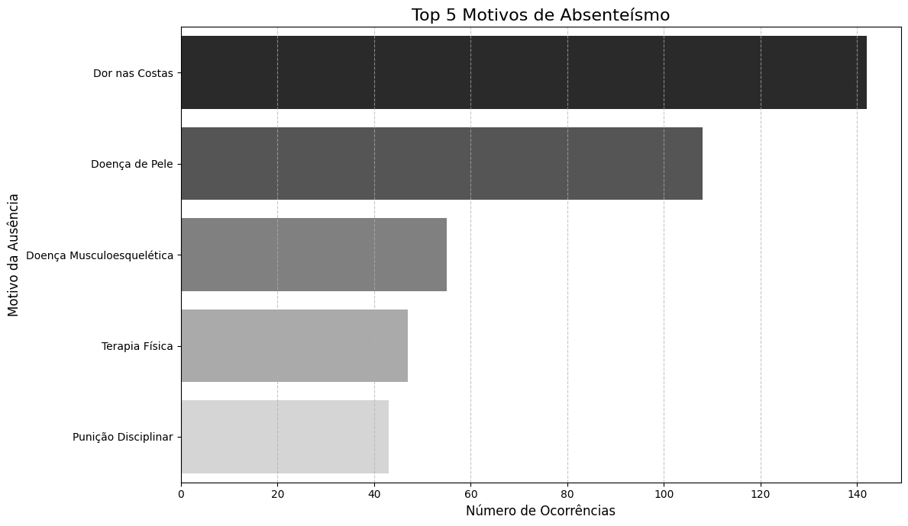
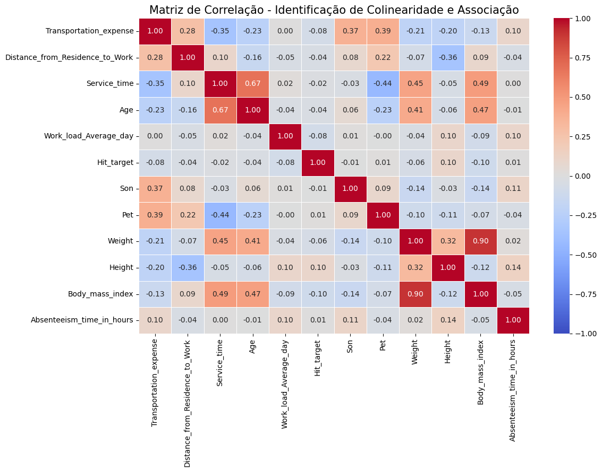
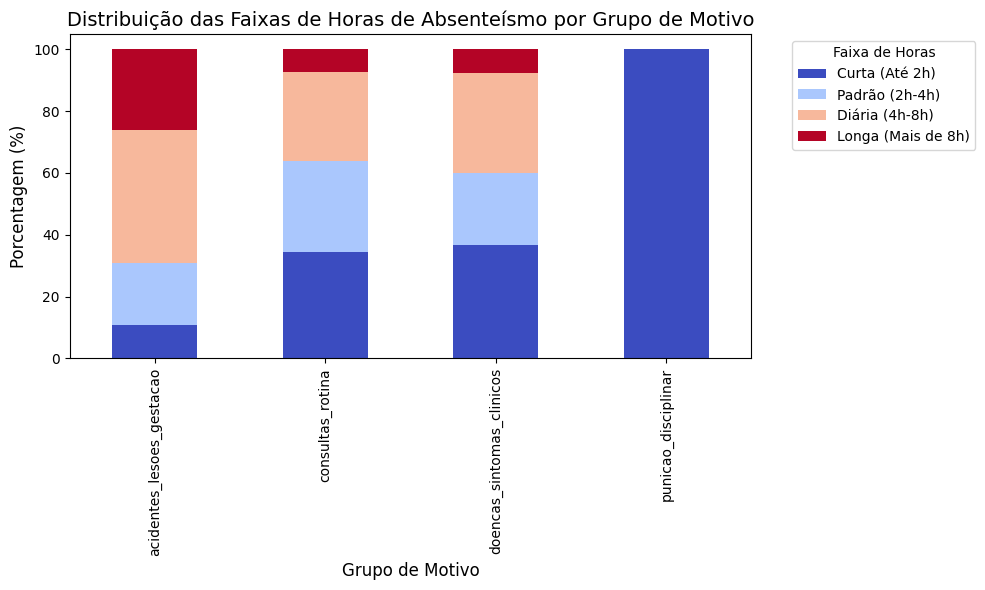
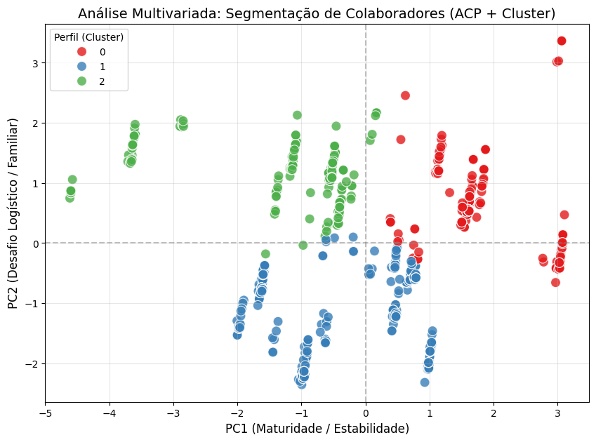
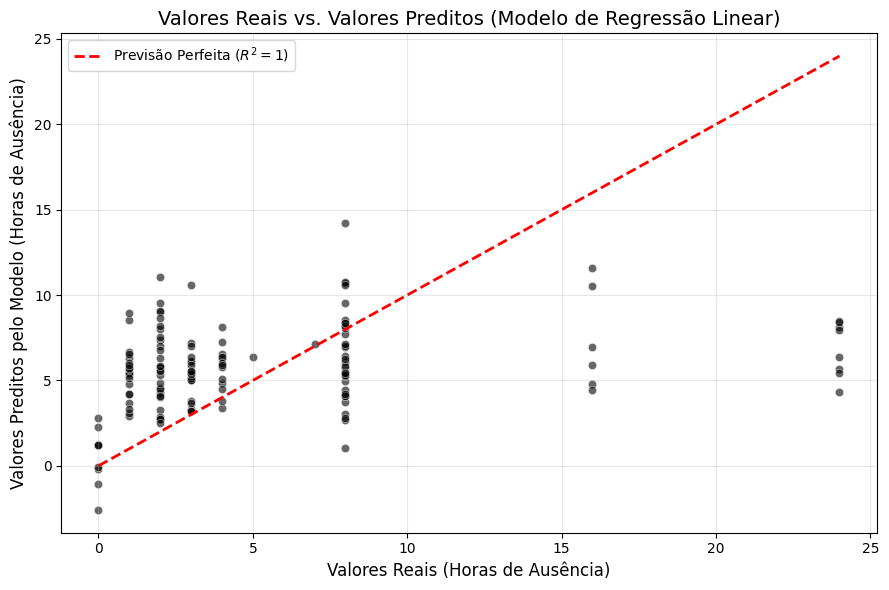

# Análise de Absenteísmo Corporativo por Sazonalidade e Perfis Comportamentais

**Autores:** Vitor Hugo Araujo Santos & Gustavo dos Santos Garcia  
**Data:** Abril de 2026  
**Linguagem & Frameworks:** Python | Pandas | SciPy | Scikit-Learn | Seaborn | Matplotlib  

---

## Resumo Executivo

O absenteísmo corporativo representa um desafio crítico para a eficiência operacional e planejamento de recursos humanos. Este projeto realiza uma Análise Exploratória de Dados (EDA) rigorosa e aplica técnicas avançadas de Tratamento de Dados (ETL), Redução de Dimensionalidade (ACP), Clusterização (K-Means) e Regressão Linear sobre um histórico de 740 registros de ausência de 36 colaboradores.

Os principais achados demonstram que o tempo de ausência é influenciado por padrões sezonalmente previsíveis, fatores logísticos (custo e distância de transporte) e perfis específicos de saúde e hábitos comportamentais, permitindo a transição de um RH reativo para uma gestão estratégica baseada em dados.

---

## Dicionário de Dados

| Variável | Tipo Armazenado | Tipo Recomendado | Descrição |
| :--- | :--- | :--- | :--- |
| **ID** | Numérico (`float`) | Categórico (Nominal) | Identificador único do colaborador (36 indivíduos). |
| **Reason_for_absence** | Numérico (`float`) | Categórico (Nominal) | Código do motivo da ausência (0–28, baseado no CID-10 e categorias internas). |
| **Month_of_absence** | Numérico (`float`) | Categórico (Ordinal) | Mês do registro de ausência (0–12; onde 0 indica dado ausente). |
| **Day_of_the_week** | Numérico (`float`) | Categórico (Nominal) | Dia da semana da ocorrência (2 = Segunda a 6 = Sexta). |
| **Seasons** | Numérico (`float`) | Categórico (Nominal) | Estação do ano (1: Verão, 2: Outono, 3: Inverno, 4: Primavera). |
| **Transportation_expense** | Numérico (`int`) | Numérico (Contínuo) | Custo mensal de transporte do colaborador (R$). |
| **Distance_from_Residence_to_Work** | Numérico (`int`) | Numérico (Contínuo) | Distância entre residência e local de trabalho (km). |
| **Service_time** | Numérico (`int`) | Numérico (Discreto) | Tempo de serviço na empresa (anos). |
| **Age** | Numérico (`int`) | Numérico (Discreto) | Idade do colaborador (anos). |
| **Work_load_Average_day** | Numérico (`float`) | Numérico (Contínuo) | Carga de trabalho média diária (produção/unidades processadas). |
| **Hit_target** | Numérico (`int`) | Numérico (Discreto) | Percentual de atingimento de meta (81% a 100%). |
| **Disciplinary_failure** | Numérico (`float`) | Categórico (Binário) | Indica falha disciplinar (0 = Não, 1 = Sim). |
| **Education** | Numérico (`float`) | Categórico (Ordinal) | Grau de escolaridade (1: Ensino Fund., 2: Médio, 3: Graduação, 4: Pós). |
| **Son** | Numérico (`int`) | Numérico (Discreto) | Número de filhos (0 a 4). |
| **Social_drinker** | Numérico (`float`) | Categórico (Binário) | Consumo social de álcool (0 = Não, 1 = Sim). |
| **Social_smoker** | Numérico (`float`) | Categórico (Binário) | Fumante social (0 = Não, 1 = Sim). |
| **Pet** | Numérico (`int`) | Numérico (Discreto) | Número de animais de estimação (0 a 8). |
| **Weight** | Numérico (`int`) | Numérico (Contínuo) | Peso corporal do colaborador (kg). |
| **Height** | Numérico (`int`) | Numérico (Discreto) | Altura do colaborador (cm). |
| **Body_mass_index** | Numérico (`int`) | Numérico (Contínuo) | Índice de Massa Corporal (19 a 38). |
| **Absenteeism_time_in_hours** | Numérico (`float`) | Numérico (Discreto) | **Variável-Alvo:** Horas totais de ausência no registro (0–120h). |

> **Nota de Pré-processamento:** Variáveis originais armazenadas como numéricas que representam categorias (como `ID`, `Reason_for_absence`, `Seasons`, etc.) foram formalmente convertidas para o tipo `string`/categórico para evitar vieses em cálculos estatísticos.

---

## Análise Exploratória de Dados (EDA) - Diagnóstico Inicial

O conjunto de dados inicial apresentou um panorama de **740 registros**, **21 atributos** e **36 colaboradores**. No diagnóstico inicial, identificaram-se inconsistências operacionais e distorções severas:

* **Colaboradores:** 36
* **Atributos:** 21
* **Registros Totais:** 740
* **Registros Duplicados:** 34
* **Registros sem Mês (Mês 0):** 3
* **Registros Nulos em Horas (0h):** 44

### Distorções na Variável-Alvo (`Absenteeism_time_in_hours`)

A análise de distribuição revelou a presença de *outliers* extremos (com pico máximo de **120 horas** de ausência em um único registro). Essa assimetria positiva elevava artificialmente a média de ausências para **7.36 horas**, mas encobria a mediana real e o comportamento padrão da equipe.

---

## Tratamento de Dados (ETL) & Limpeza

Para assegurar a integridade analítica e evitar o descarte massivo de dados, foi adotado um pipeline estruturado de limpeza e transformação:

1. **Remoção de Duplicatas:** 34 registros idênticos em todos os 21 parâmetros foram eliminados para evitar a inflação de dados nas fases visuais e estatísticas.
2. **Imputação Contextual:** Os 3 registros com mês zerado (`Month_of_absence = 0`) foram corrigidos utilizando a moda da coluna `Seasons`, preservando a coerência temporal da série.
3. **Tratamento de Anomalias Disciplinares:** A análise cruzada revelou que dos 44 registros com 0 horas de ausência, **91% (40 casos)** estavam atrelados a `Disciplinary_failure = 1` (Punições Disciplinares). Tratava-se de eventos comportamentais e não de ausências produtivas mensuráveis.
4. **Estabilização de Outliers (Winsorização):** Em vez de remover os registros extremos (o que fragmentaria a base), aplicou-se a técnica estatística de **Winsorização** na variável de horas. Esse achatamento controlado limitou a influência dos casos atípicos (120h) e neutralizou os ruídos dos nulos, entregando uma distribuição realista para as etapas de modelagem.
5. **Casting Categórico:** Atrasos na conversão de tipos foram sanados ao transformar todas as variáveis nominais/ordinais em `string`.

---

## Comunicação Visual & Padrões Identificados

### 1. Sazonalidade: A Métrica de Previsibilidade

Ao calcular a média de ausências mês a mês, identificaram-se picos de maior criticidade no ciclo anual. A análise sazonal transforma o RH de um órgão reativo para uma gestão preventiva, permitindo antecipar escalas de substituição e campanhas internas nos meses de maior incidência.

### 2. O Pareto dos Motivos

A separação entre consultas médicas de rotina e emergências revelou os maiores ofensores da produtividade. O estudo constatou que causas musculoesqueléticas (ex: Dor nas Costas) lideram tanto em frequência de ocorrência quanto no acúmulo total de horas perdidas.

---

## Análise Bivariada e Multivariada

### Matriz de Correlação & Gestão de Multicolinearidade

Ao avaliar as variáveis numéricas, observou-se uma forte correlação linear entre **Peso (`Weight`) e IMC (`Body_mass_index`) (r = 0.90)**. Para proteger os modelos futuros contra problemas de multicolinearidade (que inflam a variância dos coeficientes), as colunas de `Weight` e `Height` foram removidas, retendo-se apenas o `Body_mass_index`.

Outro achado importante foi a correlação moderada entre **Idade (`Age`) e Tempo de Serviço (`Service_time`) (r = 0.67)**. Em relação à variável-alvo, nenhuma métrica numérica isolada apresentou alta correlação linear direta (r máximo = 0.11), provando que o absenteísmo é um fenômeno complexo e multifatorial.

### Análise de Contingência por Faixas de Duração

As horas de ausência foram divididas em 4 faixas (*Curta, Padrão, Diária e Longa*):

* **Punições Disciplinares:** 100% dos casos resultam em ausências curtas (Até 2h).
* **Acidentes / Lesões / Gestação:** Concentram a maior proporção de ausências longas (**26.15%** dos casos superam 8h).

---

## Redução de Dimensionalidade, Clusterização e Regressão

### Análise de Componentes Principais (ACP) + K-Means

Aplicou-se a técnica de ACP para comprimir a alta dimensão das variáveis numéricas em fatores latentes. Retendo **44.30% da variância total** em dois componentes principais, traduziram-se as coordenadas em dois eixos interpretáveis:

* **PC1 (Maturidade / Estabilidade):** Impulsionado por Tempo de Serviço (0.535), Idade (0.483) e IMC (0.385).
* **PC2 (Desafio Logístico / Familiar):** Impulsionado por Distância do Trabalho (0.514), Custos de Transporte (0.447) e Número de Filhos (0.385).

Utilizando essas coordenadas, o algoritmo **K-Means** segmentou o quadro de funcionários em **3 clusters bem definidos**, viabilizando ações direcionadas (como subsídios focados no cluster de desafio logístico ou programas preventivos para o perfil de maior maturidade).

---

### Modelo de Regressão Linear & Interpretação de Negócio

Para quantificar a importância de cada variável no tempo final de ausência, treinou-se um modelo de Regressão Linear.

* **Métricas do Modelo:** R² = 0.0644 | MAE = 4.00 horas

> **Leitura Analítica do R²:**  
> Embora o R² seja estatisticamente baixo, isso reflete a natureza estocástica do comportamento humano e o efeito do achatamento via Winsorização. O valor do modelo não reside na capacidade de prever a hora exata da falta, mas sim no poder explicativo dos seus coeficientes matemáticos para tomada de decisão estratégica.

* **Hábitos Comportamentais:** O consumo social de álcool (`Social_drinker`) adiciona um peso positivo estimado de **+2.52 horas** no prolongamento das ausências.
* **Responsabilidade Familiar:** Cada filho adicional (`Son`) adiciona cerca de **+0.28 horas** na previsão de ausências.
* **Grupos de Motivos:** Motivos atrelados a consultas de rotina e punições possuem coeficientes fortemente negativos, ancorando as previsões em blocos de curtíssima duração.

---

## Conclusão & Próximos Passos

O estudo cumpriu o objetivo de transformar dados brutos em inteligência operacional. As análises provaram que o absenteísmo corporativo não deve ser tratado de forma homogênea: fatores logísticos, hábitos pessoais e dinâmicas sazonais operam de maneiras distintas em cada perfil de colaborador.

### Recomendações de Negócio:

1. **Planos de Mobilidade:** Rever auxílios de deslocamento para o Cluster com alto indicador de Desafio Logístico (PC2).
2. **Programas de Ergonomia Preventiva:** Focar esforços em saúde musculoesquelética para reduzir a principal causa de ausências longas (Dor nas Costas).
3. **Escalas Sazonais:** Utilizar os picos mensais de ausência identificados para ajustar o planejamento de férias e contratações temporárias.
